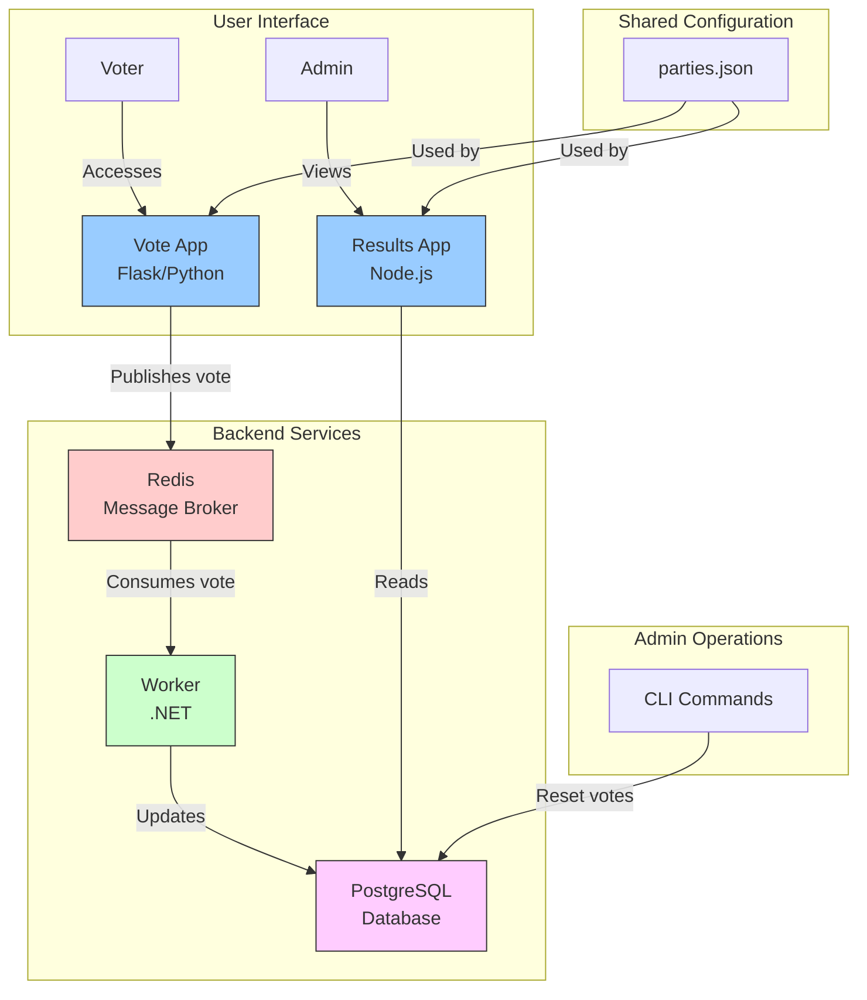

# Ghana Voting App Architecture

## System Architecture Diagram

## Component Description

1. **Vote App (Flask/Python)**
   - Provides voting interface for users
   - Renders party options from shared configuration
   - Publishes votes to Redis

2. **Results App (Node.js)**
   - Displays real-time voting results
   - Shows party standings with percentages
   - Reads data from PostgreSQL

3. **Worker (.NET)**
   - Processes votes from Redis
   - Updates vote counts in PostgreSQL
   - Runs continuously to handle incoming votes

4. **Redis**
   - Acts as message broker between Vote App and Worker
   - Enables decoupling of vote submission and processing

5. **PostgreSQL**
   - Stores party information and vote counts
   - Provides data for the Results App

6. **Shared Configuration**
   - Contains party details (names, colors)
   - Ensures consistency across services

## Data Flow

1. User submits vote through Vote App
2. Vote App publishes vote to Redis
3. Worker consumes vote from Redis
4. Worker updates vote count in PostgreSQL
5. Results App reads updated data from PostgreSQL
6. Results App displays updated results to users

## Deployment

The entire application is containerized using Docker and orchestrated with Docker Compose, making it easy to deploy to any environment that supports Docker.