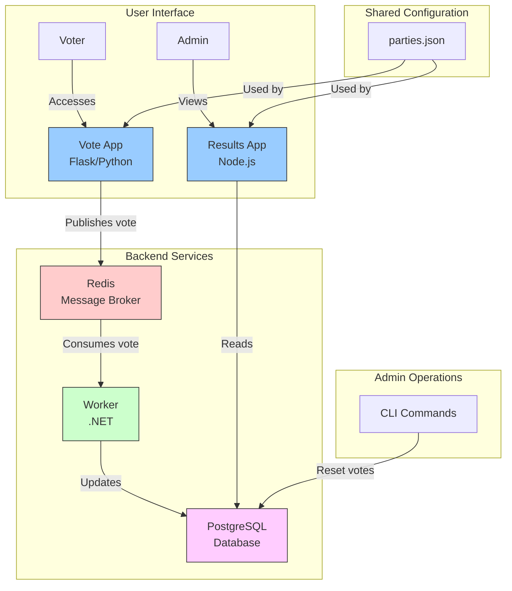

# Ghana Voting Application

<div align="center">
  
  
  
  
  
  
  
  
</div>

A distributed voting application for Ghana elections using microservices architecture.

## Table of Contents

1. [Overview](#overview)
2. [Architecture](#architecture)
3. [Installation](#installation)
4. [Configuration](#configuration)
5. [Usage](#usage)
6. [Administration](#administration)
7. [Documentation](#documentation)
8. [Troubleshooting](#troubleshooting)

## Overview

The Ghana Voting Application is a microservices-based system designed to handle voting during elections. It provides a user-friendly interface for voters to cast their votes and a real-time dashboard for viewing election results.

**Key Features:**
- Simple and intuitive voting interface
- Real-time results dashboard with visual representations
- Distributed architecture for scalability and reliability
- Containerized deployment for easy setup and maintenance

## Architecture



### Components

1. **Vote App (Flask/Python)**
   - Provides the voting interface
   - Publishes votes to Redis

2. **Results App (Node.js)**
   - Displays real-time election results
   - Reads data from PostgreSQL

3. **Worker (.NET)**
   - Processes votes from Redis
   - Updates the database

4. **Redis**
   - Acts as a message broker
   - Enables asynchronous processing

5. **PostgreSQL**
   - Stores voting data
   - Provides persistence

## Installation

### Prerequisites

- Docker and Docker Compose
- Git

### Setup

1. Clone the repository:
   ```bash
   git clone https://github.com/yourusername/ghana-voting-app.git
   cd ghana-voting-app
   ```

2. Start the application:
   ```bash
   docker-compose up -d
   ```

3. Access the applications:
   - Voting interface: http://localhost:5000
   - Results dashboard: http://localhost:5001

## Configuration

### Party Configuration

Political parties are configured in the `/config/parties.json` file:

```json
{
  "NPP": {"name": "New Patriotic Party", "color": "#0F4CA8"},
  "NDC": {"name": "National Democratic Congress", "color": "#006B3F"},
  "CPP": {"name": "Convention People's Party", "color": "#D21034"}
}
```

Each party has:
- A unique code (e.g., "NPP")
- A full name
- A color for visual representation

### Environment Variables

The application uses environment variables defined in the `docker-compose.yml` file:

- `POSTGRES_USER`: Database username
- `POSTGRES_PASSWORD`: Database password
- `POSTGRES_DB`: Database name
- `REDIS_HOST`: Redis hostname

## Usage

### Casting a Vote

1. Access the voting interface at http://localhost:5000
2. Select a political party
3. Click "Submit Vote"
4. Receive confirmation of your vote

### Viewing Results

1. Access the results dashboard at http://localhost:5001
2. View real-time vote counts and percentages
3. Results automatically refresh every 5 seconds

## Administration

### Resetting Votes

To reset all votes (admin only):

```bash
make reset-votes
```

This command sets all vote counts back to zero while preserving the party data.

### Database Management

The PostgreSQL database can be accessed directly for advanced operations:

```bash
docker-compose exec db psql -U postgres
```

## Documentation

Detailed documentation is available in the `docs` directory:

- [Deployment Guide](docs/deployment.md) - Instructions for deploying to AWS and other environments
- [Development Guide](docs/development.md) - Information for developers working on the project
- [API Documentation](docs/api.md) - Details about the application's APIs

## Troubleshooting

### Common Issues

1. **Services not starting**
   - Check Docker logs: `docker-compose logs`
   - Ensure all ports are available

2. **Votes not appearing in results**
   - Check Redis connection: `docker-compose logs redis`
   - Check Worker service: `docker-compose logs worker`

3. **Database connection issues**
   - Verify PostgreSQL is running: `docker-compose ps`
   - Check database logs: `docker-compose logs db`

## Powered By

Blakk Brother Inc.