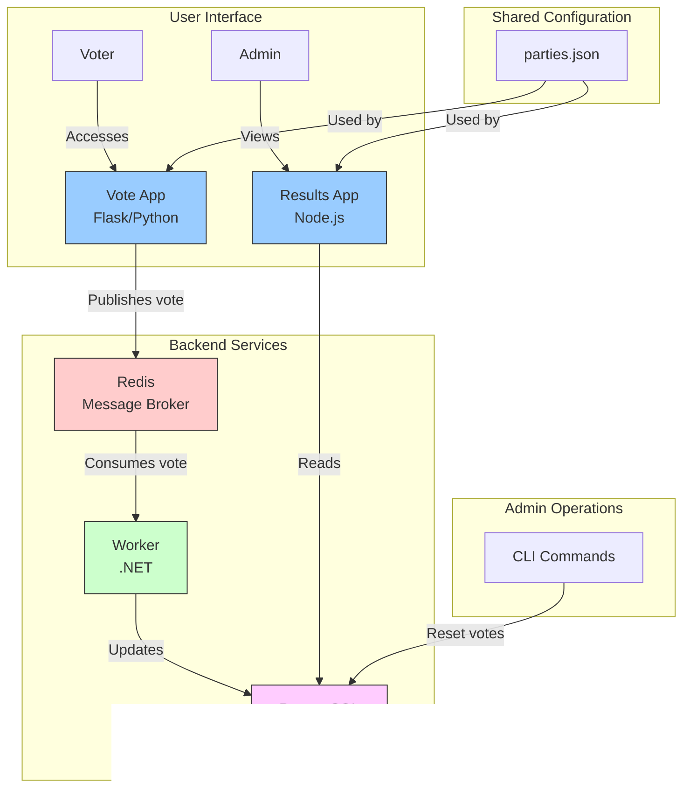

# Ghana Voting Application

A distributed voting application for Ghana elections using microservices architecture.

## Architecture



The application consists of several microservices:

- **Vote**: A Flask web app where users cast their votes
- **Worker**: A .NET service that processes votes and updates the database
- **Result**: A Node.js web app that displays real-time voting results
- **Redis**: Used as a message queue
- **PostgreSQL**: Stores the voting data

## Shared Configuration

All services use a shared configuration for political parties stored in `/config/parties.json`.

## Running the Application

```bash
docker-compose up
```

- Vote application: http://localhost:5000
- Results dashboard: http://localhost:5001

## Reset Votes

To reset all votes (admin only):

```bash
make reset-votes
```

## Powered By

Blakk Brother Inc.